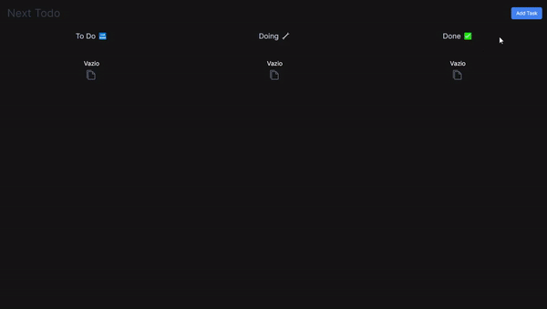

# Kanbext 📋🎯

Bem-vindo ao Kanbext, uma Aplicação Full Stack cujo objetivo é ser semelhante ao Jira implementado o método Kanban. Segue uma lista com as tecnologias utilizadas

<p align="center">
    
</p>

-   ⚛️ React
-   🔲 Next.js
-   🔵 TypeScript
-   💠 Tailwind
-   🗄️ MySQL
-   🔶 Laravel
-   🐘 PHP

## Funcionalidades ✨

-   [ ] Crie, visualize e gerencie quadros Kanban com facilidade 📝
-   [ ] Adicione e organize tarefas em diferentes colunas (To Do, Doing, Done, etc.) ✅
-   [ ] Mova as tarefas entre as colunas com arrastar e soltar intuitivo 🔄

## Pré-requisitos 🚀

-   Tenha um Editor de código como Visual Studio Code, Sublime Text, Atom etc.

-   Tanto na pasta `front-end` como `back-end` contém instruções de como iniciar este projeto. Entre em cada uma delas usando o seguinte comando pelo terminal do seu editor de código

```bash
    cd front-end
    #or
    cd back-end
```

-   Dentro de cada um deles há um arquivo `README.md` com as instruções necessárias. Mas comece configurando primeiro o `back-end`, que possui mais requisitos

## Instalação e Configuração 🔧

1. Faça o clone deste repositório em sua máquina local.
2. Após ter configurado tudo conforme os `README.md` que estão nas pastas `front-end` e `back-end`, rode ambos projetos seguindo os passos dos dois `README.md`.
3. Agora, Navegue até `http://localhost:3000` em seu navegador para acessar a aplicação.

## Contato ✉️

Se você tiver alguma dúvida, sugestão ou feedback, fique à vontade para entrar em contato:

Nome: Alfredo
E-mail: alfredofontinele08@gmail.com
